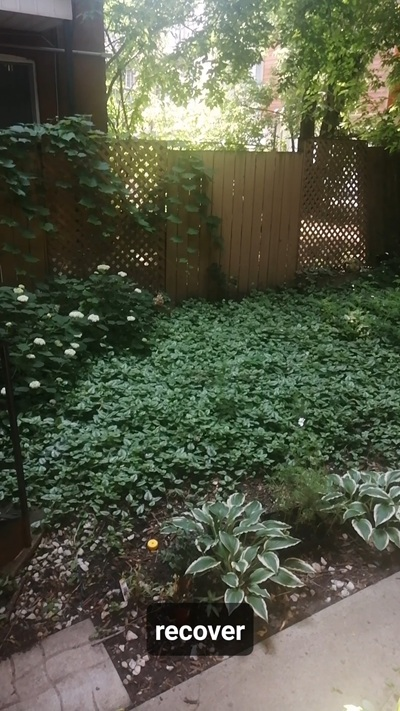
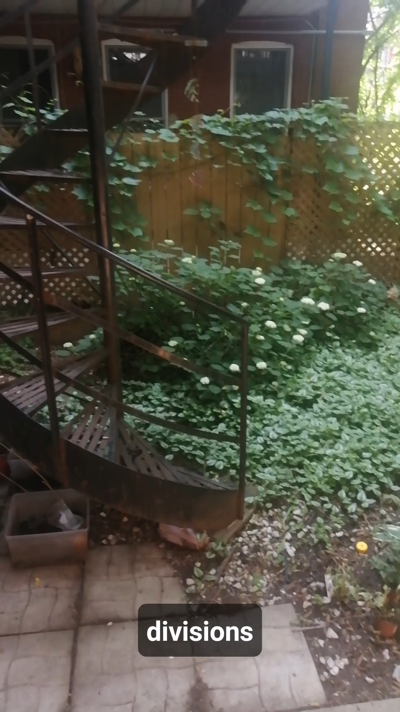
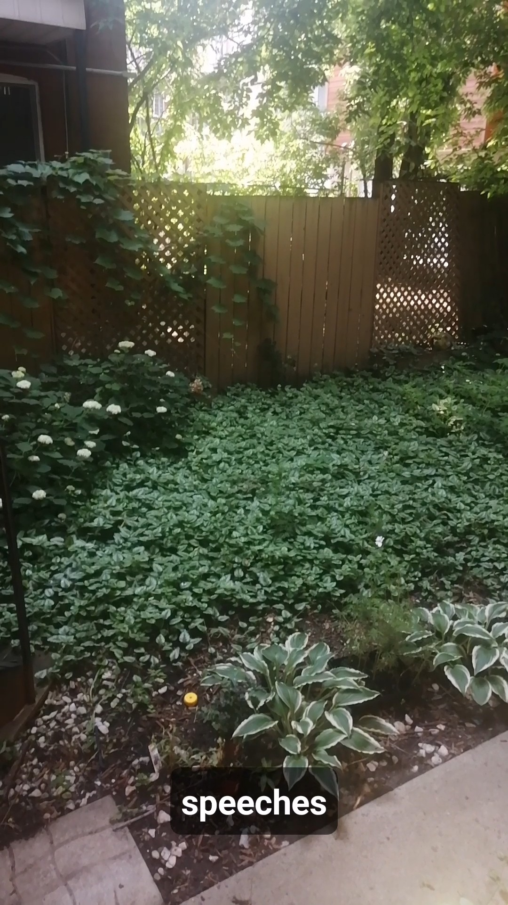

# POV TikTok

An Android app that turns a live EEG headset feed into on-screen "subtitles" over a
full-screen camera view, and records the result as a shareable POV-style video. It also
ships two standalone tools: a raw-EEG CSV **Recorder** and a diagnostic **Translator**
terminal.

The app talks to **NeuroSky / TGAM-style** EEG headsets over Bluetooth (the classic
MindWave-family hardware) and decodes the ThinkGear serial protocol directly.

> **Note:** the "subtitles" are not a decoding of thoughts. Each incoming raw EEG sample
> is mapped to a word from a fixed word list purely as a fun/artistic effect
> (see [Word mapping](#word-mapping)). Treat it as an entertainment/art piece, not a
> brain-to-text device.

---

## Build & run

Standard Android Gradle project.

| Setting        | Value                       |
|----------------|-----------------------------|
| `applicationId`| `com.pov.tiktok`            |
| `minSdk`       | 26 (Android 8.0)            |
| `targetSdk` / `compileSdk` | 34 (Android 14)  |
| Language       | Java (source/target 17)     |
| UI             | AndroidX + Material 3       |

```bash
./gradlew assembleDebug        # build APK
./gradlew installDebug         # build + install on a connected device
```

You need a **physical device** — the app requires a real back camera, microphone, and a
paired Bluetooth EEG headset. Pair the headset in Android system settings *before* using
the in-app device picker (the app lists bonded devices; it does not run discovery).

---

## Permissions

Declared in `AndroidManifest.xml` and requested at runtime as needed:

- `CAMERA`, `RECORD_AUDIO` — mandatory; the app finishes if either is denied.
- `BLUETOOTH_CONNECT` (+ legacy `BLUETOOTH` / `BLUETOOTH_ADMIN` on ≤ Android 11) — to open
  the headset socket.
- `FOREGROUND_SERVICE` and the typed variants `…_MEDIA_PROJECTION`, `…_MEDIA_PLAYBACK`,
  `…_CONNECTED_DEVICE` — for the two foreground services.
- `POST_NOTIFICATIONS` — optional; needed to show the ongoing service notifications.
- `WAKE_LOCK` — keeps the CPU alive so the EEG reader thread survives Doze.
- `INTERNET` — declared but not used by app logic.

---

## Screens

The app has one launcher activity plus two tools reachable from its bottom nav.

### 1. `MainActivity` — camera + EEG subtitles (the main experience)

Layout: `res/layout/activity_main.xml`. A `TextureView` camera preview fills the screen;
overlaid on top are an EEG status/connect bar, a large centered **subtitle**, and the
action buttons.

Flow:

1. **Camera preview** — opens the back camera via Camera2, picking a 16:9 video size
   (≤ 1080p) and a matching preview size, and applies a rotation/scale transform so the
   preview fills the screen. The camera is tied to the activity lifecycle (opened in
   `onResume`, closed in `onStop`).
2. **Choose EEG device** — `connectBtn` shows a picker of paired Bluetooth devices. On
   selection the app starts `EegPlaybackService` as a foreground service and hands it the
   chosen device.
3. **Train / Start** — the two primary buttons both require the EEG map to be loaded and a
   headset connected:
   - **Train** — activates subtitle+audio playback *without* recording (a rehearsal mode).
   - **Start** (Record) — requests screen capture via `MediaProjection`, then starts
     `ScreenRecordService` to record the whole screen (camera preview **and** the burned-in
     subtitle overlay) to an MP4. Tapping again (**Stop**) ends the recording.
4. **Recorder / Term** — navigation buttons that open the two tools below.

While playback is active, `EegPlaybackService` pushes subtitle words back to the activity,
which displays them in the large overlay `TextView`.

### 2. `RecorderActivity` — raw EEG capture to CSV

Layout: `res/layout/activity_recorder.xml`. A minimal data-collection tool.

- Connect to a headset (same paired-device picker).
- **Start Capture** streams raw EEG samples (`onRaw`) into memory, showing a live value,
  running sample count, progress bar, and estimated time remaining.
- Capture targets **1,000,000 samples** at an assumed **512 Hz**; it auto-saves when the
  target is hit, or immediately on **Stop & Save**.
- Output: a single-column CSV (`raw_eeg` header, one integer per row) written to the
  device **Downloads/** folder as `eeg_raw_<timestamp>.csv` via `MediaStore`.

### 3. `TranslatorActivity` — TGAM diagnostic "terminal"

Layout: `res/layout/activity_translator.xml`. A themed, retro-terminal read-out of the full
headset stream — a port of an earlier `translator.php`.

- Loads `assets/eeg_map.csv` and maps each raw value to a "neural state" label.
- Shows live **raw value**, **poor-signal %**, **attention** (eSense), and five EEG band
  bars: **delta, theta, alpha, beta, gamma** (from the ThinkGear `ASIC_EEG_POWER` packet).
- **Start Logging** records a throttled frame (every 400 ms) with timestamp, mapped state,
  attention, link quality, and human-readable band classifications (e.g. delta →
  `Alert / Relaxed / Deep Sleep`).
- **Export** writes the log to **Downloads/** as `neural_report_<timestamp>.csv`.
- A scrolling on-screen log (capped at the last 60 lines) narrates activity.

---

## How the EEG pipeline works

### `BtEegClient` — Bluetooth + ThinkGear parser

`BtEegClient.java` owns the link. It:

1. Opens an RFCOMM/SPP socket (`00001101-…-…805F9B34FB`) to the chosen device on a
   dedicated `bt-eeg-reader` thread.
2. Parses the **ThinkGear** framing:
   `0xAA 0xAA PLENGTH PAYLOAD CHECKSUM`, where the checksum is `~(sum of payload) & 0xFF`.
3. Walks payload tuples by code and emits typed callbacks:
   - `0x02` **POOR_SIGNAL** → `onPoorSignal(level)`
   - `0x04` **ATTENTION** (eSense 0–100) → `onAttention(level)`
   - `0x80` **RAW** (2-byte signed big-endian) → `onRaw(value)`
   - `0x83` **ASIC_EEG_POWER** (8 × 3-byte band values) → `onEegBands(...)`

Any error (EOF, `SecurityException`, dropped link) surfaces as `onDisconnected(reason)` so
the UI never gets stuck on "connecting…". All three screens reuse this one client.

### `EegPlaybackService` — the always-on brain of the main screen

`EegPlaybackService.java` is a bound **foreground service** so the EEG link and audio keep
running even when the activity is stopped (screen off / backgrounded). It:

- Holds a `BtEegClient` and a `WordBank`.
- Runs a `PARTIAL_WAKE_LOCK` so the reader thread isn't suspended during Doze.
- On a **2-second tick** (while playback is active and connected), reads the latest raw
  value, maps it to a word, and — when the word changes — updates the subtitle and plays
  the matching MP3.
- Exposes a `StateListener` the activity binds to for connection/signal/subtitle/map-ready
  updates, and posts an ongoing notification with a **Disconnect** action.

### `WordBank` — word mapping + audio

`WordBank.java` builds a word list from a decrypted `eeg_map.csv` (rows of
`eegValue,word,fileIndex`). Given a raw sample it returns
`words[ floorMod(raw, words.size()) ]` and lazily plays `assets/audio/<fileIndex>.mp3`
through a single `MediaPlayer` (clips are opened on demand — preloading ~6000 clips would
ANR the app).

### `EegMapVault` — encrypted map decryption

The playback map is shipped encrypted. `EegMapVault.java` decrypts `eeg_map.csv.enc`
(format: `IV(12) || ciphertext || GCM tag(16)`) with **AES-256-GCM**. The key is the
SHA-256 of a 50-character passphrase that is *never stored as a string* — its 25
two-character tiles sit on a 5×5 board and are re-assembled at runtime by walking an
**open knight's tour** (Warnsdorff's rule, ties broken by move order) from the top-left
square. The deterministic tour always yields the same passphrase, hence the same key.

### `ScreenRecordService` — video capture

`ScreenRecordService.java` wraps `MediaProjection` + `MediaRecorder` in a foreground
service. It mirrors the display into a `VirtualDisplay` and encodes H.264 video (10 Mbps,
30 fps) + AAC audio (from the mic) to an MP4. Because it captures the *screen*, the camera
preview and the subtitle overlay are burned into the same file. Output is written to the
app's external **Movies/** dir as `pov_<timestamp>.mp4`.

---

## Assets

- `assets/eeg_map.csv` — plaintext value→word map (~6000 rows), used by
  `TranslatorActivity`.
- `assets/audio/1.mp3 … 6000.mp3` — one spoken-word clip per map entry, played by
  `WordBank`.
- `assets/eeg_map.csv.enc` — the **encrypted** map that `EegPlaybackService` decrypts via
  `EegMapVault`. This file is *not* checked into the repo; the main-screen subtitle/audio
  playback needs it present at build time (`loadEegMap()` fails gracefully and simply marks
  the map "not ready" if it is missing).

---

## File map

```
app/src/main/
├── AndroidManifest.xml            # permissions, activities, services
├── java/com/pov/tiktok/
│   ├── MainActivity.java          # camera preview + subtitles + record button
│   ├── RecorderActivity.java      # raw-EEG → Downloads/*.csv
│   ├── TranslatorActivity.java    # TGAM diagnostic terminal + band read-out
│   ├── BtEegClient.java           # Bluetooth SPP + ThinkGear protocol parser
│   ├── EegPlaybackService.java    # foreground service: EEG link + subtitle/audio
│   ├── ScreenRecordService.java   # foreground service: MediaProjection screen record
│   ├── WordBank.java              # value→word map + per-word MP3 playback
│   └── EegMapVault.java           # AES-GCM decryption of the encrypted word map
├── res/layout/                    # activity_main, activity_recorder, activity_translator, wave_row, …
└── assets/
    ├── eeg_map.csv                # plaintext map (Translator)
    ├── eeg_map.csv.enc            # encrypted map (playback) — not committed
    └── audio/1.mp3 … 6000.mp3     # word clips
```

---

## Outputs at a glance

| Screen      | Action        | File                                  | Location    |
|-------------|---------------|---------------------------------------|-------------|
| Main        | Start/Stop    | `pov_<timestamp>.mp4`                 | `Movies/` (app-external) |
| Recorder    | Stop & Save   | `eeg_raw_<timestamp>.csv`             | `Downloads/` |
| Translator  | Export        | `neural_report_<timestamp>.csv`       | `Downloads/` |
